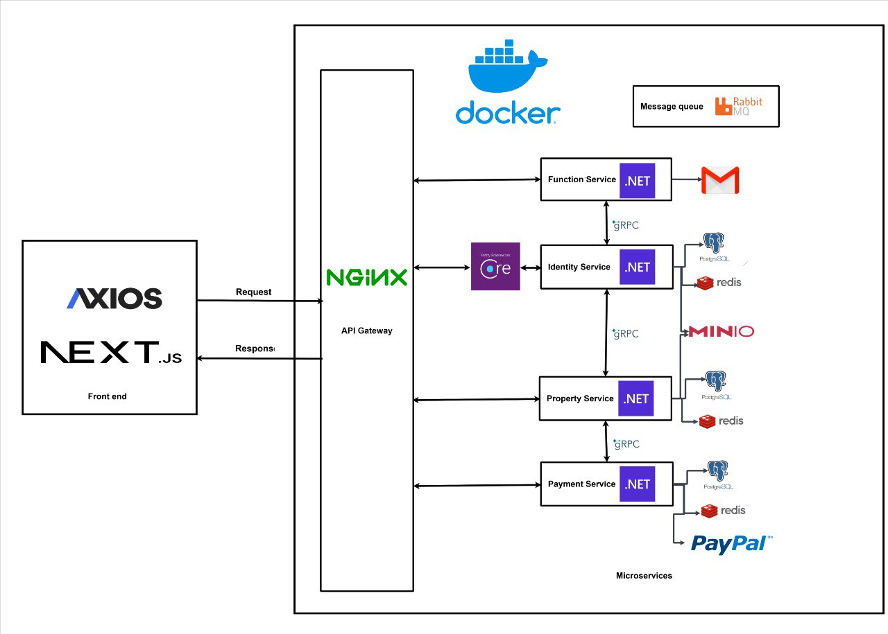

# Estate Elite

Estate Elite is a modern real estate management and transaction platform, built with a microservices architecture. It supports property listing, project management, user authentication, secure payments, and more, aiming to digitalize and streamline the real estate market.

## Project Goals

- Provide a comprehensive digital platform for real estate transactions and management.
- Enable users to search, list, manage, and transact properties efficiently and securely.
- Ensure scalability, security, and easy integration with external services.

## System Architecture

Estate Elite is composed of several main components:

- **Frontend:**
  - `estate-elite-ui`: A modern web application built with Next.js, offering a user-friendly interface for end-users and administrators.
- **Backend (Microservices):**
  - `IdentityService`: Manages user authentication, authorization, registration, login (supports Google OAuth), and user profile management.
  - `PropertyService`: Handles property projects, listings, types, amenities, rooms, images, and related data.
  - `PaymentService`: Manages payment processing, integrates with PayPal, and handles transactions and invoices.
  - `FunctionalService`: Provides auxiliary features such as email notifications, verification codes, and other background tasks.
- **Infrastructure:**
  - **PostgreSQL:** Main relational database for persistent data.
  - **Redis:** Distributed cache for performance and temporary data storage.
  - **RabbitMQ:** Message broker for asynchronous communication between services.
  - **Minio:** Object storage for files (images, documents, etc.).
  - **Nginx:** Acts as a reverse proxy, load balancer, SSL terminator, and routes REST/gRPC traffic.

### Architecture



## Service Overview

### IdentityService

- **Purpose:** User management, authentication, authorization.
- **Features:**
  - User registration, login (JWT, Google OAuth)
  - Role-based access (Buyer, Seller, Admin)
  - Profile management
- **Tech:** .NET 9, gRPC, REST API, JWT, Google OAuth

### PropertyService

- **Purpose:** Property and project management.
- **Features:**
  - Manage property projects, listings, types, rooms, amenities
  - Search, filter, CRUD operations for properties
  - Image/document management (via Minio)
- **Tech:** .NET 9, gRPC, REST API, PostgreSQL, Minio

### PaymentService

- **Purpose:** Payment and transaction management.
- **Features:**
  - Integrate with PayPal for secure payments
  - Manage transactions, invoices
- **Tech:** .NET 9, gRPC, REST API, PayPal SDK

### FunctionalService

- **Purpose:** Auxiliary/background services.
- **Features:**
  - Send verification emails, notifications
  - Handle background jobs (event-driven via RabbitMQ)
- **Tech:** .NET 9, REST API, RabbitMQ, MailKit

### estate-elite-ui

- **Purpose:** User and admin web interface.
- **Features:**
  - Property/project search, listing, and management
  - User authentication, profile, and dashboard
  - Payment and transaction UI
  - Admin dashboard for project/property management
- **Tech:** Next.js, React, Redux, TailwindCSS, React Query, PayPal JS SDK

## Infrastructure Dependencies

- **PostgreSQL**: Main database for all services
- **Redis**: Caching and session storage
- **RabbitMQ**: Event/message bus for microservices
- **Minio**: Object storage for images and files
- **Nginx**: Reverse proxy, SSL, load balancing

## Quick Start

### Prerequisites

- Docker & Docker Compose
- .NET 9 SDK (for backend development)
- Node.js >= 18 (for frontend development)

### 1. Clone the Repository

```bash
git clone <repo-url>
cd estate-elite
```

### 2. Setup Environment Variables

- Copy `.env.example` to `.env` and fill in required values (see `devops/docker-compose.yml` for all variables):
  - Database, Redis, RabbitMQ, Minio, SMTP, JWT, PayPal, etc.

### 3. Start All Services with Docker Compose

```bash
docker compose -f devops/docker-compose.yml up --build
```

- Frontend: http://localhost:3000
- Backend APIs: Routed via Nginx (see `devops/nginx/nginx.conf.template`)

### 4. Development (Optional)

- **Frontend:**
  ```bash
  cd src/Web/estate-elite-ui
  npm install
  npm run dev
  ```
- **Backend Example:**
  ```bash
  cd src/Services/IdentityService/IdentityService.API
  dotnet run
  ```

## API & Frontend Features

- **REST API & gRPC**: All core services expose both REST and gRPC endpoints.
- **Authentication**: JWT, Google OAuth 2.0
- **Payments**: PayPal integration
- **Admin Dashboard**: Manage users, projects, properties
- **User Dashboard**: Search, list, manage properties, view transactions
- **File Storage**: Upload and manage images/documents via Minio
- **Email**: SMTP-based notifications and verification

## SSL/TLS

- Use `devops/certificate-generation.sh` to generate local development certificates for gRPC and Nginx.

## Contact

For questions, feedback, or bug reports, please contact to me:

- Email: ngovanlau2003@gmail.com
- Or open an issue on the repository

---
